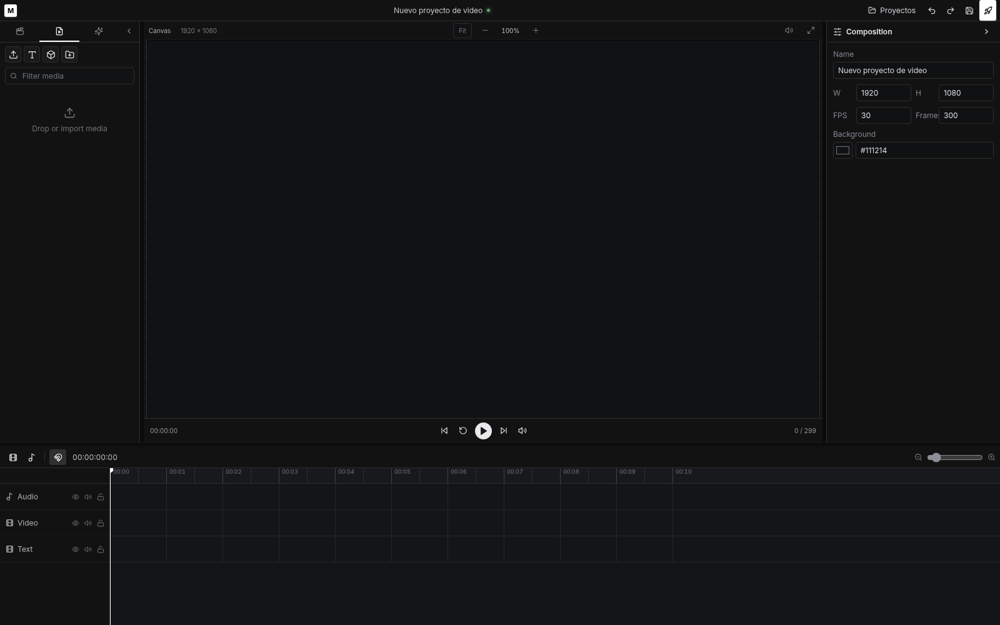
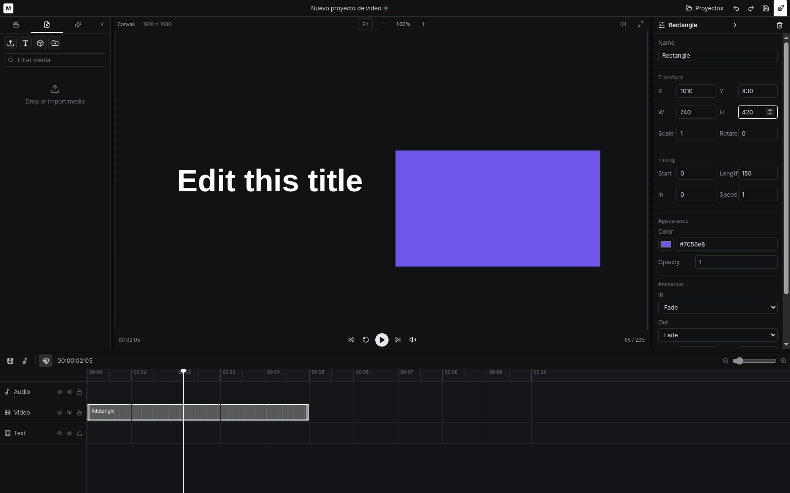

# Mosaico Studio

Editor visual de video que corre en local, construido con [Remotion](https://www.remotion.dev/).

Abres el estudio, importas medios, editas en un canvas con composición y timeline, e exportas el resultado — sin subir tu material a la nube.

## Qué es

**Mosaico** es un editor de video local con interfaz de estudio: panel de medios, canvas de composición, inspector y timeline. Está pensado para editar y renderizar en tu máquina, con un documento declarativo que puedes tocar a mano o desde scripts/API.

## Para qué sirve

- Montar piezas cortas (texto, formas, clips) con una UI visual
- Guardar proyectos, medios y renders en una carpeta de workspace
- Validar y aplicar cambios al documento por CLI o API (humano + automatización)

## Objetivo

Ofrecer un flujo de edición local, reproducible y controlable: el mismo documento alimenta la UI, la validación y el render con Remotion + ffmpeg.

## Capturas

### Estudio vacío

Panel de medios, canvas, composición e inspector, y timeline listos para empezar.



### Editor con contenido

Texto y forma en el canvas, clips en el timeline e inspector activos.



## Cómo ejecutarlo

### Un solo comando

Con Node.js 20.14+ y `ffmpeg`/`ffprobe` en el sistema:

```bash
npx github:josanager/mosaico mi-proyecto
```

Crea la carpeta `mi-proyecto` (proyectos, medios, renders) y arranca el estudio.

Para usar el directorio actual:

```bash
npx github:josanager/mosaico .
```

### Desarrollo local

```bash
npm install
npm run dev
```

- Interfaz: `http://localhost:3002`
- API / render: `http://localhost:3001`

Modo empaquetado:

```bash
npm run build
npm start
```

## Stack

- **Remotion** — composición y render de video
- **Node.js** — servidor local y CLI (`>= 20.14`)
- **ffmpeg / ffprobe** — procesamiento de medios en el sistema

## Desarrollo / Documentación

### CLI

Instalación global opcional:

```bash
npm install -g git+https://github.com/josanager/mosaico.git
mosaico-studio ./mi-proyecto
```

Opciones útiles:

```bash
mosaico-studio --workspace ./mi-proyecto --port 3001 --no-open
```

Documento, validación y operaciones:

```bash
mosaico-studio document --workspace ./mi-proyecto
mosaico-studio validate --workspace ./mi-proyecto
mosaico-studio apply operations.json --workspace ./mi-proyecto
```

### API local

```text
GET  /api/document
PUT  /api/document
POST /api/operations
```

### Controles del editor

| Atajo | Acción |
| --- | --- |
| Espacio | Reproducir / pausar |
| ← / → | Un frame |
| Shift + ← / → | Diez frames |
| Delete | Borrar clip seleccionado |
| Cmd/Ctrl + Z | Deshacer |
| Cmd/Ctrl + Shift + Z | Rehacer |
| Cmd/Ctrl + S | Guardar |

### Render tuning

```bash
npm run benchmark:render
```

Guarda el perfil en `projects/render-tuning.json` del workspace activo.